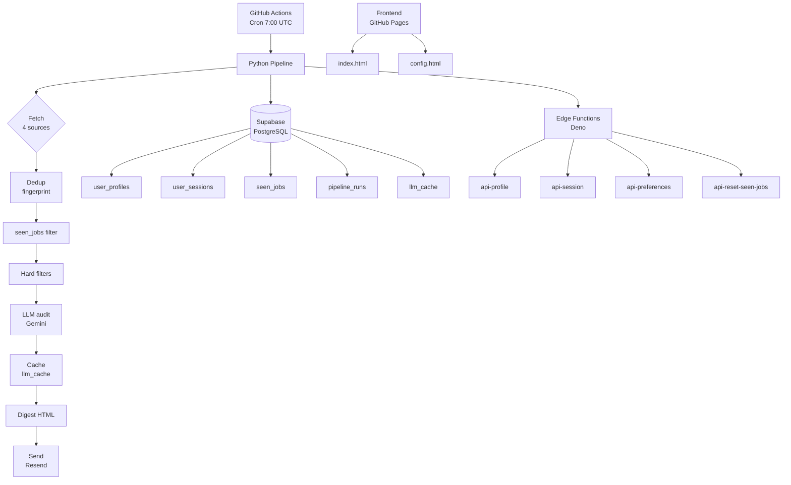

<div align="center">

# 📡 Job Radar

**Autonomous remote job market monitoring with LLM-powered quality audit.**

[](https://opensource.org/licenses/MIT)
[](https://www.python.org/)
[](https://github.com/features/actions)
[](https://supabase.com/)
[](https://ai.google.dev/)
[](https://resend.com/)
[](https://github.com/kasperstan1-boop/job-radar)

</div>

---

Job Radar scans 4 global remote job boards every day, filters out duplicates and irrelevant offers, then uses **Google Gemini (LLM)** to perform a quality audit of each posting — detecting hidden call centers, surveillance software requirements, and lack of salary transparency. Results are delivered to a personalized email digest.

> **💡 Project philosophy:** We filter job offers through the lens of **remote worker quality of life**, not just keywords. This is our USP against LinkedIn and Indeed.

**[🚀 Quick start](#-quick-start) · [✨ Features](#-features) · [🏗️ Architecture](#️-architecture) · [💭 Design decisions](#-a-note-on-scope-and-design-decisions) · [🤖 How this was built](#-how-this-was-built) · [⚠️ Known limitations](#️-known-limitations)**

---

## 💭 A note on scope and design decisions

**This project is deliberately built as a minimum viable version — but a fully working one.**

The original vision was significantly more ambitious: dozens of job boards across multiple industries, support for a much wider range of positions (including niche domains such as **trading, iGaming, analytics, and specialized technical roles**), the ability to **select job agencies as data sources**, richer filtering by contract type and timezone, and multi-user teams.

However, I made a deliberate architectural decision:

> **Every single component must run for exactly $0.00 USD per month, forever — using only the free tiers of GitHub Actions, Supabase, Google Gemini, and Resend.**

This constraint forced me to strip the system down to the absolute minimum viable implementation, while still preserving everything that makes Job Radar useful. Every design choice — the number of sources, the LLM throttle, the size of the digest, the retention policies — is calibrated so that **free cloud tiers never get exceeded**, and the accounts never get rate-limited or blocked.

In other words: this is not "a demo that stops working after one run". It is a **production-grade system that runs autonomously 24/7, costs nothing, and can be scaled up instantly** by removing a small number of configuration limits when budget becomes available.

**What would change with proper funding:**

| Area                  | MVP (this repo, $0)                               | Scaled-up version                                                           |
| --------------------- | ------------------------------------------------- | --------------------------------------------------------------------------- |
| **Sources**           | 4 global boards (RemoteOK, Remotive, Jobicy, WWR) | 15–30 boards, including niche iGaming, trading, and data-annotation portals |
| **Positions**         | 18 role tags across 4 pillars                     | Hundreds of role categories, dynamically extracted from postings            |
| **Agencies**          | Direct employer postings only                     | Ability to whitelist or block recruitment agencies as sources               |
| **LLM**               | Gemini Free Tier (throttled to ~120 calls/run)    | Dedicated Gemini paid tier — no throttle, 10× more offers processed per run |
| **Users**             | Single active user (MVP architecture)             | Multi-tenant SaaS with team accounts, shared digests, and role-based access |
| **Email delivery**    | `onboarding@resend.dev` sandbox                   | Verified custom domain, branded sender, higher monthly quota                |
| **Database**          | Supabase Free (500 MB)                            | Supabase Pro — unlimited growth, backups, and PITR                          |
| **Delivery channels** | Email + Teams webhook                             | + Slack, Telegram, Discord, RSS, mobile push notifications                  |
| **Scoring**           | Static prompt-based LLM audit                     | Personalized re-ranker trained on user feedback (👍/👎)                     |
| **Languages**         | English-only postings                             | Multi-language normalization and translation                                |

**The point:** every architectural decision in this repo is made so that _adding money later is a configuration change, not a rewrite_. The code, the schema, the abstractions, and the CI/CD pipeline are all ready for scale — they are only throttled at the surface level to stay free.

---

## 🤖 How this was built

**I want to be fully transparent about this — because I believe honesty matters more than appearances.**

**I am not a programmer. I have never written a line of production code in my life, and I have no formal background in software engineering.**

What I _did_ bring to this project:

- 🧠 **The entire product vision** — the idea, the market gap, the USP, the target audience
- 🎯 **All product decisions** — which sources matter, which filters to build, what counts as a "good" job offer, what a quality digest should look like
- 🧪 **All testing and quality control** — I ran every script, checked every output, reported every bug, and refused to accept "it kind of works" as a final answer
- 🔍 **Domain expertise** — 14 years in the iGaming/betting industry as an IP Trader, which shaped exactly what Job Radar should detect and reject
- ♻️ **Relentless iteration** — dozens of rounds of "this is wrong, fix it, test again" until the system actually worked end-to-end
- 💬 **Every prompt, every requirement, every correction** — written, reviewed, and verified by me, not auto-generated

**The code itself was written with the help of AI coding assistants** (Claude, GitHub Copilot, and Cursor). I described what I needed; the assistant wrote the code; I tested it; when it broke, I described what broke; the assistant fixed it; I tested again. Repeat, dozens of times, until everything worked.

**This is not a shortcut — it is a modern development methodology**, sometimes called _AI-assisted development_ or _vibe coding_. It is how a growing number of products are being shipped today, especially by solo founders and domain experts who know _what_ to build but not _how_ to type it.

**What this project proves:**

- I can take a complex idea from zero to a working product without writing code myself
- I understand software architecture well enough to direct it (separation of concerns, security, testing, CI/CD, idempotency, error handling, cost engineering)
- I can read and evaluate code well enough to spot when something is wrong
- I can run, debug, and iterate on a real system until it works under production-like constraints
- I know how to leverage AI tools effectively — which is rapidly becoming a _core skill_, not a substitute for one

**If you are a recruiter or hiring manager reading this:** I am not applying for a job as a software engineer. I am applying as someone who can _design, direct, and deliver_ technical products — the kind of person who understands the problem deeply enough to specify it, test it, and refuse to ship it until it actually works.

---

## ⚠️ Known limitations

**No project is perfect. Here is an honest list of what this MVP does _not_ do well, and why — including real bugs, dead ends, and compromises I ran into while building it.**

### 1. The Golden Dataset is tiny (20 offers)

The `tests/eval_dataset/eval_jobs.json` contains **20 hand-labelled offers**. This gives a _directional_ sense of precision (currently 100% on all three filters), but it is **not statistically significant**. One mislabelled offer swings precision by 5 percentage points. **A production-grade evaluation set would need 200+ offers**, ideally stratified across sources, industries, and languages.

### 2. The No-Phone filter relies on keywords + LLM — and can be fooled

The filter combines keyword heuristics (`SPYWARE_SIGNALS`, `PHONE_SIGNALS` in `filters.py`) with an LLM audit. This catches obvious cases ("excellent diction", "40 hours on the phone"), but **an offer that hides a call-center requirement behind creative wording — or buries it deep in a job description — will slip through**. There is no adversarial test set for this. It will be fooled eventually.

### 3. The LLM cache has no TTL and no content-change detection

When an offer is analysed once, its result is stored in `llm_cache` keyed by fingerprint — and **never invalidated**. If a company edits the offer text (adds a phone requirement, removes salary), the cache will still return the _old_ audit. A proper cache would re-hash the raw text and expire stale entries.

### 4. `email_verified` is not actually enforced by `api-session`

In the current flow, `api-profile` sets `email_verified = false` on registration. But `api-session` (which exchanges the token for a session) does **not check that flag**. That means: technically, a user could log into the configuration panel _without ever clicking the verification link_. The double opt-in is implemented at the _send_ layer but not enforced at the _auth_ layer. This is a known gap I did not close before shipping the MVP.

### 5. The pipeline is not idempotent against partial failures

If the pipeline crashes **mid-run** — for example, halfway through the LLM loop after the 5th of 31 offers — the `seen_jobs` table will contain the offers processed so far, but `pipeline_runs` will show `status = running` forever. There is **no recovery mechanism** and **no automatic retry**. A real production system would use checkpoints, atomic transactions, or a proper job queue.

### 6. There is no CI/CD for tests

Unit tests (`tests/test_filters.py`, etc.) and the LLM evaluation script (`tests/eval_dataset/eval_prompts.py`) are **run manually**. There is **no GitHub Actions workflow that runs them on every push or PR**. The `digest.yml` workflow only runs the production pipeline on cron. This means a breaking change to `filters.py` could be merged and only discovered the next morning when the digest breaks.

### 7. The frontend does almost no client-side validation

The configuration panel in `index.html` submits the form directly to `api-preferences` via `fetch`. **There is no client-side check** that a numeric field is within range, that a webhook URL is well-formed, or that the email field has a valid TLD. All validation errors surface only **after** the request reaches the Edge Function. This is the opposite of modern UX best practice.

### 8. Costs are not monitored at all

The Gemini Free Tier is used without any tracking of **daily API call count**, **token usage**, or **remaining quota**. If Google were to change their free tier limits, or if a user were to accidentally switch to a paid Gemini plan, **nothing in the system would warn about it**. A `MAX_LLM_CALLS_PER_RUN = 120` cap exists, but it is a hard-coded constant, not a dynamic budget enforced at runtime.

### 9. Real bugs I ran into (and fixed)

For transparency, these are actual bugs encountered during development — each one required real debugging to resolve:

- **New Google Gemini key format.** Google rolled out a new `AQ.Ab8...` API key format during development. My code initially rejected it because it only accepted legacy `AIzaSy...` keys. Fixed by switching to functional validation instead of regex-matching.
- **Supabase Edge Functions reject new `sb_publishable_` keys.** The Gateway returned `401 UNAUTHORIZED_INVALID_API_KEY` when using the new publishable key format. Had to switch the frontend to legacy `anon` JWT keys (`eyJ...`). Undocumented, silent, took hours to diagnose.
- **Cross-origin httpOnly cookies don't work between GitHub Pages and Supabase.** The initial design used `Set-Cookie` from the Edge Function to a page on `github.io`. Browsers silently blocked it as a third-party cookie (Safari ITP, Chrome Privacy Sandbox). Redesigned to use `sessionStorage` + `Authorization: Bearer`.
- **LLM prompt didn't propagate `phone_signals` → `async_friendly`.** The first prompt had `async_friendly = true only if no phone calls`. The model kept saying `async_friendly: true` for offers with a clearly-flagged `phone_signals` array. Fixed by adding an explicit consistency rule in the system instruction: _"if `phone_signals` is non-empty, `async_friendly` MUST be false"_.
- **The `freshness_hours: 24` default nuked 217 of 220 offers.** The first production run returned zero results because RemoteOK / Remotive / Jobicy return offers that are 48–72 hours old, not 24. Changed default to `168` (7 days) and added a UI field.
- **A single typo in the Supabase URL broke everything silently.** `djnauhtmjlwssvheujoi` vs. `djnautkmjlwssvheujoi` — two letters swapped. The frontend just said `Failed to fetch`, and no server-side log ever showed a request. Took 4 debug rounds to find.

### 10. What I deliberately did _not_ build (yet)

- **Recruitment agency filtering** — I wanted to whitelist / blacklist specific agencies, but most public APIs don't expose agency metadata in a reliable way. Dropped for MVP.
- **iGaming and betting industry sources** — researched and drafted (BettingJobs, Pentasia, iGB Jobs, ParlayJobs), but deferred because scraping HTML behind Cloudflare is expensive to maintain, and none of them offer a clean public API.
- **Multi-user support** — the schema supports it (`user_profiles` is multi-row), but the pipeline still selects only the first active user. True multi-tenancy would require per-user LLM throttling, per-user timezones, and a queue.

**Why I am documenting all of this:** because pretending everything is perfect is the fastest way to lose a technical reader's trust. A project that lists its own bugs and limitations is a project that someone actually _understood_.

---

## 🎯 The problem we solve

Most remote job seekers waste hours manually scanning listings full of traps: hidden call centers disguised as "assistants", offers with no salary range, or toxic companies requiring surveillance software on your personal computer.

Job Radar automates this process and **eliminates 90% of the noise** — you only receive offers that match your quality criteria.

---

## ✨ Features

### Unique quality filters (market advantage)

| Filter                             | Description                                                                                                                             |
| ---------------------------------- | --------------------------------------------------------------------------------------------------------------------------------------- |
| **📞 No-Phone Guarantee**          | LLM detects linguistic manipulation masking call centers ("excellent diction", "handling incoming calls", "dynamic phone environment"). |
| **🛡️ Anti-Spyware & Async-First**  | Detection of requirements to install monitoring software (Time Doctor, Hubstaff, screenshots, keylogger, webcam).                       |
| **💰 Salary transparency**         | Rejection of offers without explicit salary ranges or based on unfair wording ("pay dependent on engagement").                          |
| **📅 Freshness and geo-filtering** | Job age filters (24h / 48h / 7 days) and "Worldwide only".                                                                              |

### Everything else

| Feature                           | Description                                                                                   |
| --------------------------------- | --------------------------------------------------------------------------------------------- |
| **🌐 4 data sources**             | RemoteOK, Remotive, Jobicy, WeWorkRemotely (API + RSS).                                       |
| **🔐 Passwordless access**        | `sec_...` token in URL fragment, exchanged for `session_token` (httpOnly via sessionStorage). |
| **⚙️ Web configuration panel**    | 18 roles, 8 filters, salary range, blocklist, Teams webhook.                                  |
| **🔄 Cross-source deduplication** | SHA-256 fingerprint of (company\|title\|location\|salary).                                    |
| **⚡ LLM cache**                  | Same offers = 1 Gemini call (saves quota).                                                    |
| **🔁 Model fallback**             | Automatic switch on 429/5xx errors.                                                           |
| **📊 Sentry**                     | Optional error monitoring.                                                                    |
| **⏰ GitHub Actions**             | Cron at 7:00 UTC daily + manual trigger.                                                      |

---

## 🏗️ Architecture



**Tech stack:**

| Layer              | Technology                                                                 |
| ------------------ | -------------------------------------------------------------------------- |
| **Backend**        | Python 3.12, `google-genai`, `supabase-py`, `resend`, `bleach`, `requests` |
| **Database**       | Supabase (PostgreSQL)                                                      |
| **Edge Functions** | Deno (TypeScript)                                                          |
| **Frontend**       | HTML/CSS/JS (GitHub Pages)                                                 |
| **LLM**            | Google Gemini (Flash-Lite, Flash, Pro)                                     |
| **Email**          | Resend (REST API)                                                          |
| **CI/CD**          | GitHub Actions (cron + manual)                                             |
| **Monitoring**     | Sentry (optional)                                                          |

---

## 🚀 Quick start

### Requirements

- **Python** 3.12+
- **Supabase account** (free tier) — database + Edge Functions
- **Google AI Studio** (free tier) — Gemini API key (`AQ.Ab8...` or `AIzaSy...`)
- **Resend** (free tier, 3000 emails/month) — email delivery
- **GitHub** — repository + Actions

### Installation

```bash
# 1. Clone the repository
git clone https://github.com/kasperstan1-boop/job-radar.git
cd job-radar

# 2. Virtual environment
python -m venv .venv
.venv\Scripts\activate  # Windows
source .venv/bin/activate  # Linux/macOS

# 3. Dependencies
pip install -r requirements.txt

# 4. Supabase setup (SQL Editor)
# Run the SQL script from the "Database schema" section below

# 5. Edge Functions
supabase link --project-ref <YOUR-PROJECT-REF>
supabase functions deploy api-profile
supabase functions deploy api-session
supabase functions deploy api-preferences
supabase functions deploy api-reset-seen-jobs

# 6. Run the pipeline
python -m jobradar.pipeline
```

<details>
<summary>📋 <strong>Database schema (click to expand)</strong></summary>

```sql
-- user_profiles
create table user_profiles (
  id                 uuid primary key default gen_random_uuid(),
  config_token_hash  text unique not null,
  email              text not null,
  email_verified     boolean default false,
  preferences        jsonb not null default '{}'::jsonb,
  schema_version     int  not null default 1,
  created_at         timestamptz default now(),
  updated_at         timestamptz default now(),
  last_digest_at     timestamptz,
  is_active          boolean default true,
  deleted_at         timestamptz
);

-- user_sessions
create table user_sessions (
  session_token_hash text primary key,
  user_id            uuid not null references user_profiles(id) on delete cascade,
  created_at         timestamptz default now(),
  expires_at         timestamptz not null,
  last_used_at       timestamptz
);

-- seen_jobs
create table seen_jobs (
  token_hash      text not null,
  job_fingerprint text not null,
  sent_at         timestamptz default now(),
  primary key (token_hash, job_fingerprint)
);

-- pipeline_runs
create table pipeline_runs (
  run_id          uuid primary key,
  started_at      timestamptz default now(),
  finished_at     timestamptz,
  status          text,
  source_stats    jsonb,
  llm_calls       int,
  llm_cost_usd    numeric(10,4),
  llm_models_used jsonb,
  error           text
);

-- llm_cache
create table llm_cache (
  job_fingerprint text primary key,
  result          jsonb not null,
  model_used      text,
  created_at      timestamptz default now()
);
```

</details>

### Configuration

```bash
cp .env.example .env
```

Fill in `.env`:

| Variable               | Description                                | Where to find                                             |
| ---------------------- | ------------------------------------------ | --------------------------------------------------------- |
| `SUPABASE_URL`         | `https://<ref>.supabase.co`                | Supabase → Settings → API                                 |
| `SUPABASE_SERVICE_KEY` | `sb_secret_...` (new) or `eyJ...` (legacy) | Supabase → Settings → API                                 |
| `GEMINI_API_KEY`       | `AQ.Ab8...` or `AIzaSy...`                 | [aistudio.google.com](https://aistudio.google.com/apikey) |
| `RESEND_API_KEY`       | `re_...`                                   | [resend.com/api-keys](https://resend.com/api-keys)        |
| `NOTIFICATION_EMAIL`   | Your email (verified in Resend)            | —                                                         |
| `TEAMS_WEBHOOK_URL`    | optional Teams webhook                     | Teams → Workflows                                         |
| `SENTRY_DSN`           | optional error monitoring                  | [sentry.io](https://sentry.io)                            |

> [!WARNING]
> In the free Resend tier without your own domain, you can only send emails **to the address you registered your Resend account with**.

---

## 📂 Project structure

```text
job-radar/
├── .github/workflows/digest.yml     # GitHub Actions cron
├── frontend/
│   ├── index.html                   # Registration + configuration panel
│   └── config.html                  # Redirect from email link
├── jobradar/
│   ├── config.py                    # Environment variables, constants
│   ├── fingerprint.py               # SHA-256 deduplication
│   ├── filters.py                   # 8 hard filters
│   ├── llm.py                       # Gemini + model fallback
│   ├── prompt.py                    # Prompt + response_schema
│   ├── digest.py                    # HTML + plain text generator
│   ├── notifier.py                  # Resend + Teams webhook
│   ├── db.py                        # Supabase client
│   ├── pipeline.py                  # Orchestrator
│   └── sources/
│       ├── remoteok.py              # Public JSON API
│       ├── remotive.py              # Public JSON API
│       ├── jobicy.py                # Public JSON API
│       └── wwr.py                   # RSS feeds
├── supabase/functions/
│   ├── api-profile/index.ts         # Registration + verification email
│   ├── api-session/index.ts         # Token → session_token exchange
│   ├── api-preferences/index.ts     # GET/PUT preferences
│   └── api-reset-seen-jobs/index.ts # History reset
├── tests/
│   ├── test_fingerprint.py          # Dedup test
│   ├── test_filters.py              # Filter tests (6 cases)
│   ├── test_all_sources.py          # 4 scrapers test
│   └── eval_dataset/                # Golden Dataset (20 offers)
├── examples/
│   ├── digest_example.html          # Sample report (HTML)
│   └── digest_example.png           # Report screenshot
├── .env.example
├── requirements.txt
└── README.md
```

---

## 📄 Sample digest

Job Radar sends a personalized HTML report every day. Each offer includes an LLM score (0–100%), a 2-sentence summary, and red flags.


> The full HTML file is available at [`examples/digest_example.html`](examples/digest_example.html).

---

## 🧪 Tests and evaluation

```bash
# Unit tests
python -m tests.test_fingerprint
python -m tests.test_filters
python -m tests.test_all_sources

# Prompt evaluation (Golden Dataset — 20 offers)
python -m tests.eval_dataset.eval_prompts
python -m tests.eval_dataset.eval_prompts --verbose
python -m tests.eval_dataset.eval_prompts --threshold 0.90
```

**Metrics (latest run):**

| Filter             | Precision | Recall | F1    |
| ------------------ | --------- | ------ | ----- |
| No-Phone Guarantee | **100%**  | 100%   | 100%  |
| Async-Friendly     | **100%**  | 90%    | 94.7% |
| Salary Disclosed   | **100%**  | 100%   | 100%  |

---

## 💰 Costs

Everything runs on free tiers:

| Service                 | Free tier limit        | Usage      |
| ----------------------- | ---------------------- | ---------- |
| GitHub Actions          | 2000 min/month         | ~5 min/day |
| Supabase (database)     | 500 MB, 2 GB transfer  | <10 MB     |
| Supabase Edge Functions | 500k invocations/month | ~30/day    |
| Google Gemini           | 15 RPM, 500–1500 RPD   | ~31/day    |
| Resend                  | 3000 emails/month      | 1/day      |
| GitHub Pages            | unlimited              | —          |

**Monthly cost: $0.00 USD.**

---

## 📄 License

MIT — use it, modify it, sell it. Code provided without warranty.

---

<div align="center">

**Built with ❤️ using free tools**

</div>
