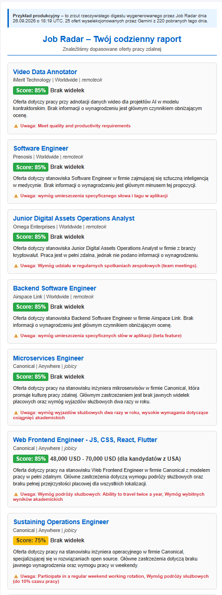

<div align="center">

# 📡 Job Radar

**Autonomiczny system monitoringu ofert pracy zdalnej z audytem jakościowym LLM.**

[](https://opensource.org/licenses/MIT)
[](https://www.python.org/)
[](https://github.com/features/actions)
[](https://supabase.com/)
[](https://ai.google.dev/)
[](https://resend.com/)
[](https://github.com/kasperstan1-boop/job-radar)

</div>

---

Job Radar codziennie skanuje 4 globalne portale pracy zdalnej, odsiewa duplikaty i oferty niepasujące, a następnie wykorzystuje **Google Gemini (LLM)** do audytu jakościowego każdego ogłoszenia — wykrywając ukryte call center, oprogramowanie szpiegujące i brak przejrzystości wynagrodzeń. Wyniki trafiają do spersonalizowanego raportu e-mail.

> **💡 Filozofia projektu:** Filtrujemy oferty pod kątem **jakości życia pracownika zdalnego**, a nie tylko słów kluczowych. To jest nasze USP wobec LinkedIn i Indeed.

**[🚀 Szybki start](#-szybki-start) · [✨ Funkcje](#-funkcje) · [🏗️ Architektura](#️-architektura) · [📂 Struktura](#-struktura-projektu) · [📄 Licencja](#-licencja)**

---

## 🎯 Problem, który rozwiązujemy

Większość osób szukających pracy zdalnej traci godziny na ręcznym przeszukiwaniu ogłoszeń pełnych pułapek: ukrytych infolinii udających „asystentów", ofert bez stawek czy toksycznych firm wymagających instalacji oprogramowania szpiegującego na prywatnym komputerze.

Job Radar automatyzuje ten proces i **eliminuje 90% szumu** — dostajesz tylko oferty, które spełniają Twoje kryteria jakościowe.

---

## ✨ Funkcje

### Unikalne filtry jakościowe (przewaga rynkowa)

| Filtr                             | Opis                                                                                                                                                |
| --------------------------------- | --------------------------------------------------------------------------------------------------------------------------------------------------- |
| **📞 No-Phone Guarantee**         | LLM wykrywa manipulacje słowne maskujące call center („doskonała dykcja", „obsługa połączeń przychodzących", „dynamiczne środowisko telefoniczne"). |
| **🛡️ Anti-Spyware & Async-First** | Wykrywanie wymogów instalacji oprogramowania monitorującego (Time Doctor, Hubstaff, screenshoty, keylogger, kamera).                                |
| **💰 Przejrzystość stawek**       | Odrzucanie ofert bez jawnych widełek lub opartych o nieuczciwe formułki („wynagrodzenie zależne od zaangażowania").                                 |
| **📅 Świeżość i geolokalizacja**  | Filtry wieku ofert (24h / 48h / 7 dni) i „Worldwide only".                                                                                          |

### Reszta funkcji

| Funkcja                             | Opis                                                                                    |
| ----------------------------------- | --------------------------------------------------------------------------------------- |
| **🌐 4 źródła danych**              | RemoteOK, Remotive, Jobicy, WeWorkRemotely (API + RSS).                                 |
| **🔐 Bezhasłowy dostęp**            | Token `sec_...` w URL fragment, wymiana na `session_token` (httpOnly w sessionStorage). |
| **⚙️ Panel konfiguracji WWW**       | 18 ról, 8 filtrów, widełki, blocklist, webhook Teams.                                   |
| **🔄 Deduplikacja między-źródłowa** | Fingerprint SHA-256 z (firma\|tytuł\|lokalizacja\|widełki).                             |
| **⚡ Cache LLM**                    | Te same oferty = 1 wywołanie Gemini (oszczędność limitów).                              |
| **🔁 Fallback modeli**              | Automatyczne przełączanie przy 429/5xx.                                                 |
| **📊 Sentry**                       | Opcjonalny monitoring błędów.                                                           |
| **⏰ GitHub Actions**               | Cron 7:00 UTC codziennie + ręczne uruchamianie.                                         |

---

## 🏗️ Architektura

````mermaid
flowchart TD
    A[GitHub Actions<br/>Cron 7:00 UTC] --> B[Python Pipeline]
    B --> C{Fetch<br/>4 sources}
    C --> D[Dedup<br/>fingerprint]
    D --> E[seen_jobs filter]
    E --> F[Hard filters]
    F --> G[LLM audit<br/>Gemini]
    G --> H[Cache<br/>llm_cache]
    H --> I[Digest HTML]
    I --> J[Send<br/>Resend]

    B --> K[(Supabase<br/>PostgreSQL)]
    K --> L[user_profiles]
    K --> M[user_sessions]
    K --> N[seen_jobs]
    K --> O[pipeline_runs]
    K --> P[llm_cache]

    B --> Q[Edge Functions<br/>Deno]
    Q --> R[api-profile]
    Q --> S[api-session]
    Q --> T[api-preferences]
    Q --> U[api-reset-seen-jobs]

    V[Frontend<br/>GitHub Pages] --> W[index.html]
    V --> X[config.html]
Stack technologiczny:

Warstwa	Technologia
Backend	Python 3.12, google-genai, supabase-py, resend, bleach, requests
Baza danych	Supabase (PostgreSQL)
Edge Functions	Deno (TypeScript)
Frontend	HTML/CSS/JS (GitHub Pages)
LLM	Google Gemini (Flash-Lite, Flash, Pro)
E-mail	Resend (REST API)
CI/CD	GitHub Actions (cron + manual)
Monitoring	Sentry (opcjonalny)
🚀 Szybki start
Wymagania
Python 3.12+

Konto Supabase (free tier) — baza + Edge Functions

Google AI Studio (free tier) — klucz Gemini (AQ.Ab8... lub AIzaSy...)

Resend (free tier, 3000 maili/mies.) — wysyłka e-maili

GitHub — repo + Actions

Instalacja
bash
# 1. Klonowanie repo
git clone https://github.com/kasperstan1-boop/job-radar.git
cd job-radar

# 2. Wirtualne środowisko
python -m venv .venv
.venv\Scripts\activate  # Windows
source .venv/bin/activate  # Linux/macOS

# 3. Zależności
pip install -r requirements.txt

# 4. Konfiguracja Supabase (SQL Editor)
# Uruchom skrypt SQL z sekcji "Schemat bazy danych" poniżej

# 5. Edge Functions
supabase link --project-ref <TWOJ-PROJECT-REF>
supabase functions deploy api-profile
supabase functions deploy api-session
supabase functions deploy api-preferences
supabase functions deploy api-reset-seen-jobs

# 6. Uruchomienie pipeline'u
python -m jobradar.pipeline
<details> <summary>📋 <strong>Schemat bazy danych (kliknij, aby rozwinąć)</strong></summary>
sql
-- user_profiles
create table user_profiles (
  id                 uuid primary key default gen_random_uuid(),
  config_token_hash  text unique not null,
  email              text not null,
  email_verified     boolean default false,
  preferences        jsonb not null default '{}'::jsonb,
  schema_version     int  not null default 1,
  created_at         timestamptz default now(),
  updated_at         timestamptz default now(),
  last_digest_at     timestamptz,
  is_active          boolean default true,
  deleted_at         timestamptz
);

-- user_sessions
create table user_sessions (
  session_token_hash text primary key,
  user_id            uuid not null references user_profiles(id) on delete cascade,
  created_at         timestamptz default now(),
  expires_at         timestamptz not null,
  last_used_at       timestamptz
);

-- seen_jobs
create table seen_jobs (
  token_hash      text not null,
  job_fingerprint text not null,
  sent_at         timestamptz default now(),
  primary key (token_hash, job_fingerprint)
);

-- pipeline_runs
create table pipeline_runs (
  run_id          uuid primary key,
  started_at      timestamptz default now(),
  finished_at     timestamptz,
  status          text,
  source_stats    jsonb,
  llm_calls       int,
  llm_cost_usd    numeric(10,4),
  llm_models_used jsonb,
  error           text
);

-- llm_cache
create table llm_cache (
  job_fingerprint text primary key,
  result          jsonb not null,
  model_used      text,
  created_at      timestamptz default now()
);
</details>
Konfiguracja
bash
cp .env.example .env
Uzupełnij .env:

Zmienna	Opis	Gdzie znaleźć
SUPABASE_URL	https://<ref>.supabase.co	Supabase → Settings → API
SUPABASE_SERVICE_KEY	sb_secret_... (nowy) lub eyJ... (legacy)	Supabase → Settings → API
GEMINI_API_KEY	AQ.Ab8... lub AIzaSy...	aistudio.google.com
RESEND_API_KEY	re_...	resend.com/api-keys
NOTIFICATION_EMAIL	Twój e-mail (zweryfikowany w Resend)	—
TEAMS_WEBHOOK_URL	opcjonalny webhook Teams	Teams → Workflows
SENTRY_DSN	opcjonalny monitoring błędów	sentry.io
[!WARNING]
W darmowym planie Resend, bez własnej domeny, można wysyłać e-maile tylko na adres, którym zarejestrowałeś konto Resend.

📂 Struktura projektu
text
job-radar/
├── .github/workflows/digest.yml     # GitHub Actions cron
├── frontend/
│   ├── index.html                   # Panel rejestracji + konfiguracji
│   └── config.html                  # Przekierowanie z linku mailowego
├── jobradar/
│   ├── config.py                    # Zmienne środowiskowe, stałe
│   ├── fingerprint.py               # SHA-256 dedup
│   ├── filters.py                   # 8 filtrów twardych
│   ├── llm.py                       # Gemini + fallback modeli
│   ├── prompt.py                    # Prompt + response_schema
│   ├── digest.py                    # Generator HTML + plain text
│   ├── notifier.py                  # Resend + Teams webhook
│   ├── db.py                        # Klient Supabase
│   ├── pipeline.py                  # Orkiestrator
│   └── sources/
│       ├── remoteok.py              # Publiczne API JSON
│       ├── remotive.py              # Publiczne API JSON
│       ├── jobicy.py                # Publiczne API JSON
│       └── wwr.py                   # Kanały RSS
├── supabase/functions/
│   ├── api-profile/index.ts         # Rejestracja + mail weryfikacyjny
│   ├── api-session/index.ts         # Wymiana token → session_token
│   ├── api-preferences/index.ts     # GET/PUT preferencji
│   └── api-reset-seen-jobs/index.ts # Reset historii
├── tests/
│   ├── test_fingerprint.py          # Test dedup
│   ├── test_filters.py              # Test filtrów (6 przypadków)
│   ├── test_all_sources.py          # Test 4 scraperów
│   └── eval_dataset/                # Golden Dataset (20 ofert)
├── examples/
│   └── digest_example.html          # Przykładowy raport
├── .env.example
├── requirements.txt
└── README.md
## 📄 Przykładowy digest

Job Radar wysyła codziennie spersonalizowany raport HTML. Każda oferta zawiera ocenę LLM (0–100%), 2-zdaniowe podsumowanie i czerwone flagi.



> Pełny HTML znajdziesz w [`examples/digest_example.html`](examples/digest_example.html).

🧪 Testy i ewaluacja
bash
# Testy jednostkowe
python -m tests.test_fingerprint
python -m tests.test_filters
python -m tests.test_all_sources

# Ewaluacja promptu (Golden Dataset — 20 ofert)
python -m tests.eval_dataset.eval_prompts
python -m tests.eval_dataset.eval_prompts --verbose
python -m tests.eval_dataset.eval_prompts --threshold 0.90
Metryki (ostatni run):

Filtr	Precision	Recall	F1
No-Phone Guarantee	100%	100%	100%
Async-Friendly	100%	90%	94.7%
Salary Disclosed	100%	100%	100%
💰 Koszty
Wszystko w darmowych planach:

Usługa	Limit free tier	Wykorzystanie
GitHub Actions	2000 min/mies.	~5 min/dzień
Supabase (baza)	500 MB, 2 GB transfer	<10 MB
Supabase Edge Functions	500k wywołań/mies.	~30/dzień
Google Gemini	15 RPM, 500–1500 RPD	~31/dzień
Resend	3000 maili/mies.	1/dzień
GitHub Pages	unlimited	—
Koszt miesięczny: 0,00 USD.

📄 Licencja
MIT — używaj, modyfikuj, sprzedawaj. Kod dostarczony bez gwarancji.

<div align="center">
Zbudowane z ❤️ przy użyciu darmowych narzędzi

</div> ```
````
